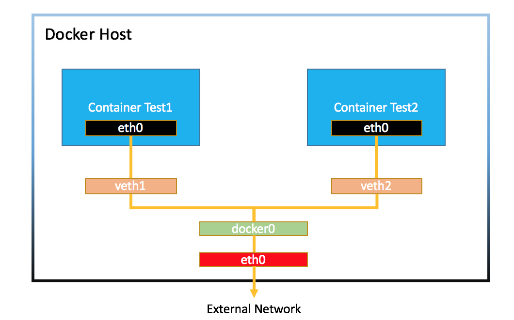
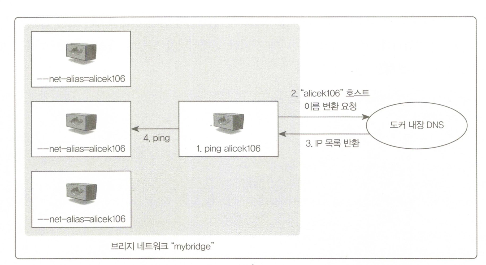
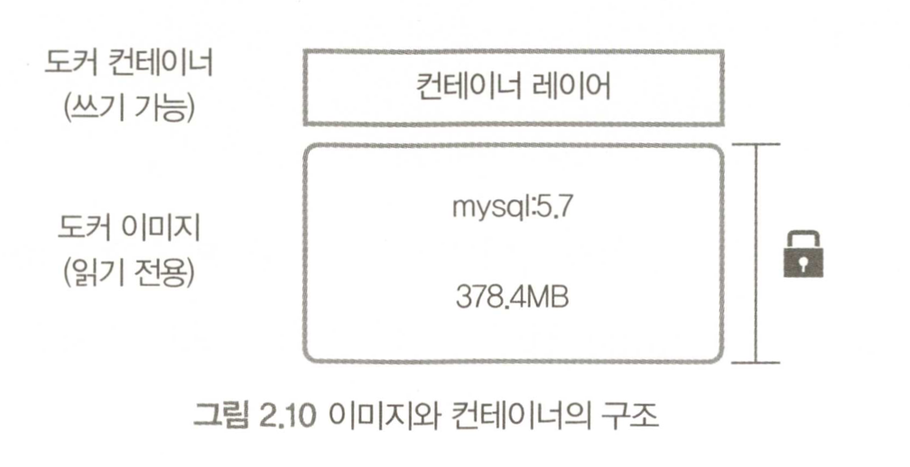
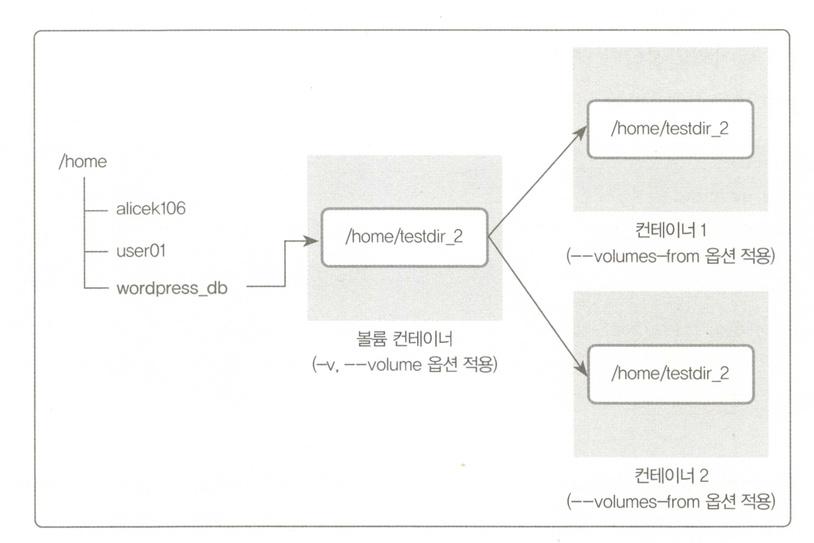
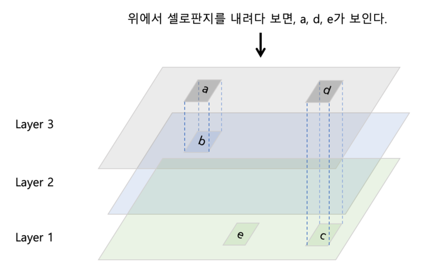

# What to do

- DB를 사용하는 간단한 방명록 서비스
- 프론트, 서버, DB 가 별도의 컨테이너에 존재
- 외부 IP에서 프론트 서버는 접근 가능 API 서버,DB서버는 접근 불가능

---

# Docker 키워드

## Run

```
docker run -i -t ubuntu
```

`docker run [OPTIONS] IMAGE [COMMAND] [ARG...]`

- -i : interactive (대화형)
- -t : pseudo-tty
- -it : -i -t
- -d : --detach docker 이미지를 background 에서 작동하도록 함
- --rm : 종료시 자동 삭제
- -e : 환경변수 `-e MYSQL_DATABASE=wordpress`

- https://docs.docker.com/engine/reference/commandline/run/

---

## Create

```
docker start my_container
```


- https://docs.docker.com/engine/reference/commandline/start/

---

## attach

```
docker run -i -t -d --name hello ubuntu:14.04
docker attach hello
```

- 실행되고 있는 컨테이너에 표준 입력과 표준 출력을 연결

- https://docs.docker.com/engine/reference/commandline/attach/
- https://medium.com/bb-tutorials-and-thoughts/docker-attach-vs-exec-commands-473f591da3a8

---

## exec

```
docker run --name ubuntu_bash --rm -i -t ubuntu bash
docker exec -d ubuntu_bash touch /tmp/execWorks
```

- -d : 백그라운드에서 실행
- -e : 환경변수
- -w : 작업 디렉토리 설정
- 실행중인 컨테이너에서 새로운 명령을 실행
- https://docs.docker.com/engine/reference/commandline/exec/

---

## Pull

```
docker pull debian
```

`docker pull [OPTIONS] NAME[:TAG|@DIGEST]`

- https://docs.docker.com/engine/reference/commandline/pull/
- https://www.44bits.io/ko/post/how-docker-image-work
- https://devaom.tistory.com/5

---

## ps

```
docker ps
```

- https://docs.docker.com/engine/reference/commandline/ps/

---

## rm

#### shotCut

`docker rm $(docker ps -a -q)`
`docker container prune`

- https://docs.docker.com/engine/reference/commandline/rm/

---

## stop

`docker stop [OPTIONS] CONTAINER [CONTAINER...]`

- 컨테이너를 중지
- https://docs.docker.com/engine/reference/commandline/stop/

## kill

` docker kill my_container`

- 컨테이너를 중지
- https://docs.docker.com/engine/reference/commandline/kill/

## stop VS kill

- stop 은 SIGTERM -> SIGKILL
- kill 은 SIGKILL
- stop이 표준이고 SIGTERM 단계에서 처리해야할 프로세스들을 있을수 있음 kill은 그것을 무시하고 SIGKILL을 전송

---

# Network

## Inside of network



- veth => virtual eth
- docker() => 각 veth 인터페이스와 바인딩 돼 호스트의 eth()인터페이스와 이어주는 역할
- https://joont92.github.io/docker/network-%EA%B5%AC%EC%A1%B0/

---

## network driver

- bridge
  - 컨테이너와 컨테이너를 연결할때 사용
  - connect, disconnect 명령어 사용 가능
  - --net-alias 로 여러개의 컨테이너의 접근가능 (p.58)
    
- host
  - 호스트의 네트워크 환경을 사용가능
- none
  - 외부와 단절
- contanier
  - 다른 컨테이너의 네트워크 네임 스페이스 공유 가능

---

## link

```
docker run --name db -d mongo
 docker run --name web -d -p 80:80 --link db:db nginx
```

- link를 쓸때 주의 할 점
  - link 의 대상이 되는 컨테이너가 없다면 컨테이너가 실행되지 않음!
  - deprecated

---

## docker port

```
docker run -i -t --name mywebserver -p 80:80 ubuntu:14.04
```

- \[호스트의 포트]:\[컨테이너의 포트] 의 형식으로 사용
- 여러개일 경우 여러번 사용
  - `docker run -i -t -p 3306:3306 -p 192.168.0.100:7777:80 ubuntu:14.04`

---

# Volume

- 도커 이미지로 컨테이너를 생성하면 ReadOnly로 생성됨
  - 컨테이너의 변경사항은 컨테이너 계층에 생성
    
- 컨테이너를 새로 생성하면 이전 변경사항이 유지 되지않음

---

## -v

```
\[호스트의 디렉토리\]:\[컨테이너의 디렉토리\]
```

- 호스트와 볼륨을 공유
- 컨테이너에 해당 디렉토리의 파일이 있다면 덮어쓰기가 됨

## --volumes-from



---

## docker volume

```bash
# create
docker volume create --name myvolume
# list
docker volume ls
# usage
docker run -i -t --name myvolume -v myvolume:/root/ ubuntu:14.04
# inspect
docker volume inspect
```

---

### volume 은 어디 있을까?

```
docker volume inspect [VOLUME_NAME]
```

```
❯ docker volume inspect minikube
[
    {
        "CreatedAt": "2020-09-03T05:03:16Z",
        "Driver": "local",
        "Labels": {
            "created_by.minikube.sigs.k8s.io": "true",
            "name.minikube.sigs.k8s.io": "minikube"
        },
        "Mountpoint": "/var/lib/docker/volumes/minikube/_data",
        "Name": "minikube",
        "Options": {},
        "Scope": "local"
    }
]
```

---

```
❯ cd /var/lib/docker/volumes/minikube/_data
cd: no such file or directory: /var/lib/docker/volumes/minikube/_data
```

맥/윈도우 에서는 VM 위에서 작동하므로 실제 위치는 다른 곳에 위치

실제는 여기 (도커 버전, OS 버전 바다 다름)

```
~/Library/Containers/com.docker.docker/Data/vms/0/Docker.raw
```

- https://stackoverflow.com/questions/19234831/where-are-docker-images-stored-on-the-host-machine/37642236#37642236

---

# log

## docker logs

```shell
docker logs mysql
```

- docker run --log-driver : 로깅을 위한 드라이버를 선택
  - https://docs.docker.com/config/containers/logging/configure/
- https://docs.docker.com/engine/reference/commandline/logs/

---

# Docker Image

- `docker search [imageName]` 으로 검색 가능
- Official 이미지를 사용할 것
  - https://www.boannews.com/media/view.asp?idx=89841
- ***

## Docker Image 생성

```shell
docker run -i -t -d --name commit_test ubuntu:14.04
docker exec -d commit_test touch /tmp/execWorks
docker commit -a "kong.jino" -m "my first commit" commit_test commit_test:first
```

---

## Docker 이미지의 구조

- 도커 이미지는 내부적으로 여러개의 레이어로 구성
  - Union mount 기능을 이용해서 파일 시스템을 중첩해서 사용
    

---

## Docker 이미지 추출

```
# 추출
docker save -o ubuntu.tar ubuntu
# 로드
docker load -i ubuntu
```

- 이미지를 단일 바이너리 파일로 저장
- 커맨드, 이미지, 태그, 메타데이터를 포함해 하나의 파일로 추출

- https://docs.docker.com/engine/reference/commandline/save/
- https://docs.docker.com/engine/reference/commandline/load/

---

## Docker 이미지 배포

```
docker login
docker push [username]/[image]
```
